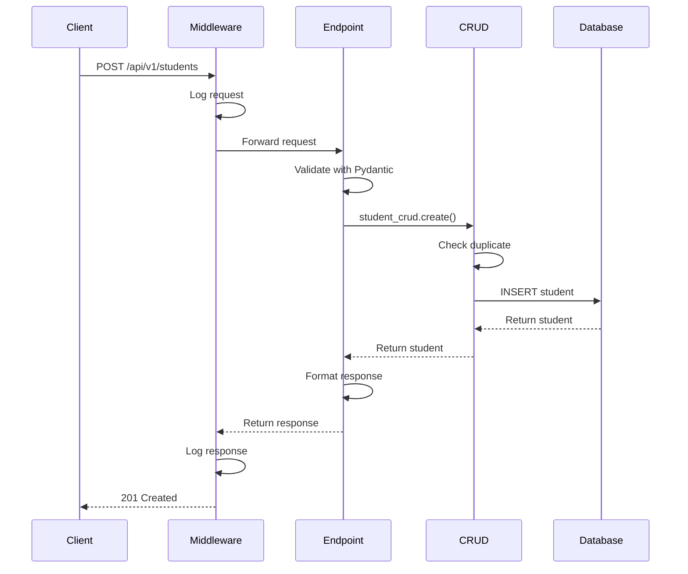
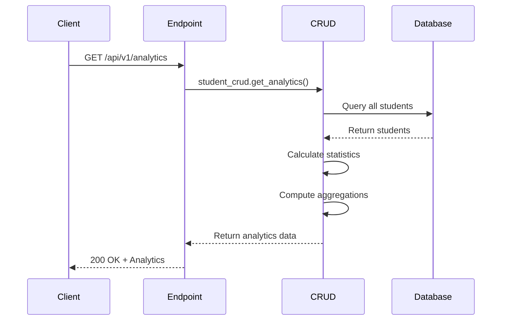
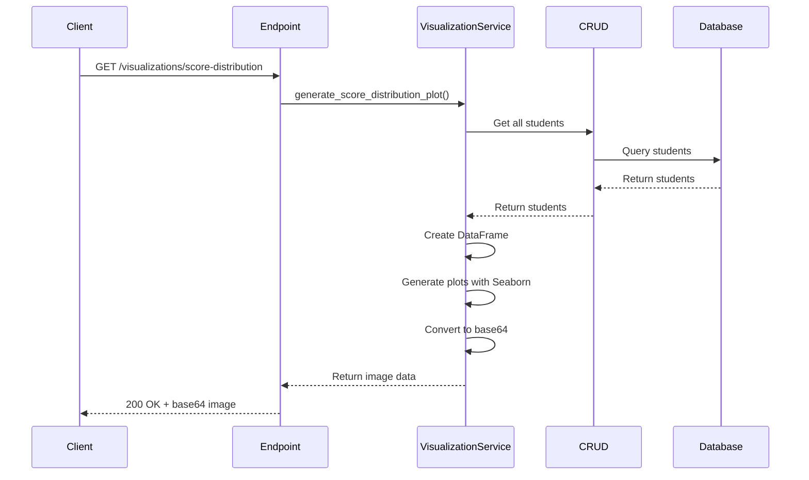

# 🏗️ System Architecture - Student Management System

## 📋 Table of Contents
1. [System Overview](#system-overview)
2. [Architecture Layers](#architecture-layers)
3. [Technology Stack](#technology-stack)
4. [Project Structure](#project-structure)
5. [Design Patterns](#design-patterns)
6. [Data Flow](#data-flow)

---

## 🎯 System Overview

Student Management System là một RESTful API backend được xây dựng với FastAPI, tuân theo kiến trúc **Layered Architecture** và **Clean Architecture principles**.

### Key Principles:
- ✅ **Separation of Concerns** - Tách biệt các layer rõ ràng
- ✅ **Dependency Injection** - FastAPI Depends()
- ✅ **Repository Pattern** - CRUD operations
- ✅ **Service Layer** - Business logic
- ✅ **DTOs/Schemas** - Data validation với Pydantic
- ✅ **Middleware Pattern** - Request/Response processing

---

## 🏛️ Architecture Layers

```
┌─────────────────────────────────────────────────┐
│         PRESENTATION LAYER (API Layer)          │
│  ┌─────────────────────────────────────────┐   │
│  │   FastAPI Routes & Endpoints            │   │
│  │   - students.py                         │   │
│  │   - analytics.py                        │   │
│  │   - visualizations.py                   │   │
│  │   - export.py                           │   │
│  └─────────────────────────────────────────┘   │
└─────────────────────────────────────────────────┘
                     ↓
┌─────────────────────────────────────────────────┐
│           SERVICE LAYER (Business Logic)        │
│  ┌─────────────────────────────────────────┐   │
│  │   Services                              │   │
│  │   - DataService                         │   │
│  │   - ExportService                       │   │
│  │   - VisualizationService                │   │
│  │   - CrawlerService                      │   │
│  └─────────────────────────────────────────┘   │
└─────────────────────────────────────────────────┘
                     ↓
┌─────────────────────────────────────────────────┐
│         DATA ACCESS LAYER (Repository)          │
│  ┌─────────────────────────────────────────┐   │
│  │   CRUD Operations                       │   │
│  │   - StudentCRUD                         │   │
│  │   - Cache Management                    │   │
│  │   - Query Optimization                  │   │
│  └─────────────────────────────────────────┘   │
└─────────────────────────────────────────────────┘
                     ↓
┌─────────────────────────────────────────────────┐
│              DATABASE LAYER                     │
│  ┌─────────────────────────────────────────┐   │
│  │   SQLModel ORM                          │   │
│  │   - Models                              │   │
│  │   - Database Engine                     │   │
│  │   - Session Management                  │   │
│  └─────────────────────────────────────────┘   │
└─────────────────────────────────────────────────┘
                     ↓
              [SQLite Database]
```

### Layer Descriptions:

#### 1. **Presentation Layer (API Layer)**
- **Responsibility**: Handle HTTP requests/responses
- **Components**: 
  - FastAPI routers
  - Request validation
  - Response formatting
  - Exception handling
- **Location**: `app/api/endpoints/`

#### 2. **Service Layer (Business Logic)**
- **Responsibility**: Implement business rules and complex operations
- **Components**:
  - Data processing (Pandas)
  - File operations (Excel, CSV, XML)
  - Visualization generation (Seaborn)
  - Web scraping
- **Location**: `app/services/`

#### 3. **Data Access Layer (Repository)**
- **Responsibility**: Database operations and data management
- **Components**:
  - CRUD operations
  - Query building
  - Caching
  - Transaction management
- **Location**: `app/crud/`

#### 4. **Database Layer**
- **Responsibility**: Data persistence
- **Components**:
  - SQLModel ORM
  - Database engine
  - Session management
- **Location**: `app/database.py`, `app/models/`

---

## 🛠️ Technology Stack

### Core Technologies:
```yaml
Framework: FastAPI 0.104.1
ORM: SQLModel 0.0.14
Database: SQLite
Validation: Pydantic 2.5.0
Server: Uvicorn 0.24.0
```

### Data Processing:
```yaml
Analytics: Pandas 2.1.4
Visualization: Seaborn 0.13.0, Matplotlib 3.8.2
Excel: openpyxl 3.1.2
XML: dicttoxml 1.7.16, lxml 4.9.3
```

### Additional Libraries:
```yaml
Web Scraping: BeautifulSoup4 4.12.2, requests 2.31.0
File Handling: aiofiles 23.2.0, python-multipart 0.0.6
Caching: cachetools 5.3.2
Testing: pytest 7.4.3, httpx 0.25.2
```

---

## 📁 Project Structure

```
BackendStudentManagement/
│
├── app/                          # Main application package
│   ├── __init__.py
│   ├── main.py                   # FastAPI application entry point
│   ├── database.py               # Database configuration
│   │
│   ├── api/                      # API layer
│   │   ├── __init__.py          # API router aggregation
│   │   └── endpoints/           # API endpoints
│   │       ├── students.py      # Student CRUD endpoints
│   │       ├── analytics.py     # Analytics endpoints
│   │       ├── visualizations.py # Visualization endpoints
│   │       ├── export.py        # Export endpoints
│   │       └── crawler.py       # Web crawler endpoints
│   │
│   ├── core/                    # Core utilities
│   │   ├── config.py           # Configuration settings
│   │   ├── dependencies.py      # Dependency injection
│   │   ├── exceptions.py        # Custom exceptions
│   │   ├── logging.py          # Logging configuration
│   │   └── pagination.py        # Pagination utilities
│   │
│   ├── crud/                    # Data access layer
│   │   └── student.py          # Student CRUD operations
│   │
│   ├── models/                  # Database models
│   │   └── student.py          # Student model & schemas
│   │
│   ├── schemas/                 # Pydantic schemas
│   │   └── __init__.py         # Common schemas
│   │
│   ├── services/                # Business logic layer
│   │   ├── data_service.py     # Data processing
│   │   ├── export_service.py   # Export operations
│   │   ├── visualization_service.py # Seaborn charts
│   │   └── crawler_service.py  # Web scraping
│   │
│   └── utils/                   # Utilities
│       └── serialization.py     # Data serialization
│
├── docs/                        # Documentation
│   └── ARCHITECTURE.md          # This file
│
├── logs/                        # Application logs (auto-created)
│   └── YYYY-MM-DD/             # Daily log folders
│
├── scripts/                     # Utility scripts
│   ├── run.py                  # Development server
│   ├── setup.bat/.sh           # Setup scripts
│   └── test_*.py               # Test scripts
│
├── tests/                       # Test suite
│   └── test_api.ps1            # API tests
│
├── requirements.txt             # Python dependencies
├── docker-compose.yml           # Docker configuration
├── Dockerfile                   # Docker image
└── README.md                    # Project documentation
```

---

## 🎨 Design Patterns

### 1. **Repository Pattern**
```python
# Location: app/crud/student.py
class StudentCRUD:
    def create(self, db: Session, *, obj_in: StudentCreate) -> Student:
        """Create operation"""
        
    def get(self, db: Session, id: int) -> Optional[Student]:
        """Read operation"""
        
    def update(self, db: Session, *, db_obj: Student, obj_in: StudentUpdate) -> Student:
        """Update operation"""
        
    def delete(self, db: Session, *, id: int) -> Student:
        """Delete operation"""
```

**Benefits**:
- Centralized data access logic
- Easy to test and mock
- Database independence
- Caching support

### 2. **Dependency Injection**
```python
# Location: app/core/dependencies.py
def get_db():
    """Database session dependency"""
    with Session(engine) as session:
        yield session

# Usage in endpoints:
@router.get("/students")
def get_students(db: Session = Depends(get_db)):
    return student_crud.get_multi(db)
```

**Benefits**:
- Loose coupling
- Easy testing
- Better code organization
- Resource management

### 3. **Service Layer Pattern**
```python
# Location: app/services/
class DataService:
    """Business logic for data processing"""
    
class ExportService:
    """Business logic for exports"""
    
class VisualizationService:
    """Business logic for visualizations"""
```

**Benefits**:
- Separation of concerns
- Reusable business logic
- Independent of API layer
- Easier to maintain

### 4. **Middleware Pattern**
```python
# Location: app/main.py
@app.middleware("http")
async def add_process_time_header(request: Request, call_next):
    # Pre-processing
    start_time = time.time()
    
    # Process request
    response = await call_next(request)
    
    # Post-processing
    process_time = time.time() - start_time
    response.headers["X-Process-Time"] = str(process_time)
    
    return response
```

**Benefits**:
- Cross-cutting concerns (logging, timing, auth)
- Clean separation
- Reusable across endpoints

### 5. **DTO (Data Transfer Object) Pattern**
```python
# Location: app/models/student.py
class StudentBase(SQLModel):
    """Base fields"""
    
class StudentCreate(StudentBase):
    """For creation"""
    
class StudentUpdate(StudentBase):
    """For updates"""
    
class StudentResponse(StudentBase):
    """For responses"""
```

**Benefits**:
- Input validation
- Output formatting
- API versioning support
- Type safety

---

## 🔄 Data Flow

### Request Flow Diagram:

```
[Client Request]
      ↓
[FastAPI Middleware]
      ↓ (Logging, Timing, CORS)
[API Router/Endpoint]
      ↓ (Validation with Pydantic)
[Dependency Injection]
      ↓ (Database Session)
[Service Layer] (Optional)
      ↓ (Business Logic)
[CRUD Layer]
      ↓ (Database Operations)
[SQLModel ORM]
      ↓ (Query Building)
[Database]
      ↓
[Response Back Through Layers]
      ↓
[Client Response]
```

### Detailed Example - Create Student:

```
1. CLIENT sends POST /api/v1/students
   Body: {
     "student_id": "SV001",
     "first_name": "John",
     "last_name": "Doe",
     "math_score": 8.5,
     ...
   }
   
2. MIDDLEWARE (app/main.py)
   - Logs incoming request
   - Starts timer
   - Sets CORS headers
   
3. API ENDPOINT (app/api/endpoints/students.py)
   - Validates request body with StudentCreate schema
   - Injects database session via Depends(get_db)
   
4. VALIDATION (Pydantic)
   - Checks required fields
   - Validates data types
   - Runs custom validators
   
5. CRUD LAYER (app/crud/student.py)
   - Checks if student_id exists
   - Creates Student model instance
   - Adds to database session
   - Commits transaction
   
6. DATABASE (SQLModel + SQLite)
   - Executes INSERT statement
   - Returns created record
   
7. RESPONSE FORMATTING
   - Converts to StudentResponse schema
   - Calculates computed fields (full_name, average_score, grade)
   
8. LOGGING & METRICS
   - Logs successful operation
   - Records execution time
   - Logs to daily log file
   
9. CLIENT receives response
   Status: 201 Created
   Body: {
     "id": 1,
     "student_id": "SV001",
     "full_name": "John Doe",
     "average_score": 8.5,
     "grade": "Excellent",
     ...
   }
```

---

## 📊 Component Interactions

### Student CRUD Flow:


### Analytics Flow:


### Visualization Flow:


---

## 🔐 Security Layers

```
┌─────────────────────────────────────┐
│  TrustedHost Middleware             │
│  - Validates Host header            │
└─────────────────────────────────────┘
              ↓
┌─────────────────────────────────────┐
│  CORS Middleware                    │
│  - Cross-Origin Resource Sharing    │
└─────────────────────────────────────┘
              ↓
┌─────────────────────────────────────┐
│  Input Validation                   │
│  - Pydantic schemas                 │
│  - Type checking                    │
│  - Custom validators                │
└─────────────────────────────────────┘
              ↓
┌─────────────────────────────────────┐
│  Exception Handling                 │
│  - Catch all exceptions             │
│  - Log errors                       │
│  - Return safe error messages       │
└─────────────────────────────────────┘
```

---

## 📈 Performance Optimizations

### 1. **Caching**
```python
# In-memory cache with TTL
class StudentCRUD:
    def __init__(self):
        self.cache = {}
        self.cache_timestamps = {}
        
    def _get_from_cache(self, key: str):
        if self._is_cache_valid(key):
            return self.cache[key]
        return None
```

### 2. **Query Optimization**
- Selective field loading
- Pagination for large datasets
- Index on frequently queried fields

### 3. **Async Operations**
- FastAPI async support
- Background tasks for long operations
- Async file operations with aiofiles

### 4. **Connection Pooling**
- SQLModel engine with connection pool
- Efficient resource management

---

## 🧪 Testing Strategy

```
Unit Tests
  ↓
Integration Tests
  ↓
API Tests
  ↓
End-to-End Tests
```

### Test Files:
- `tests/test_api.ps1` - API endpoint tests
- `test_seaborn_demo.py` - Visualization tests
- `test_pandas_analytics.py` - Analytics tests

---

## 📝 Next Steps

For more detailed documentation, see:
- [CODE_FLOW.md](CODE_FLOW.md) - Detailed request/response flows
- [API_DOCUMENTATION.md](API_DOCUMENTATION.md) - API specifications
- [DATABASE_SCHEMA.md](DATABASE_SCHEMA.md) - Database design

---

**Last Updated**: October 5, 2025
**Version**: 1.0.0
